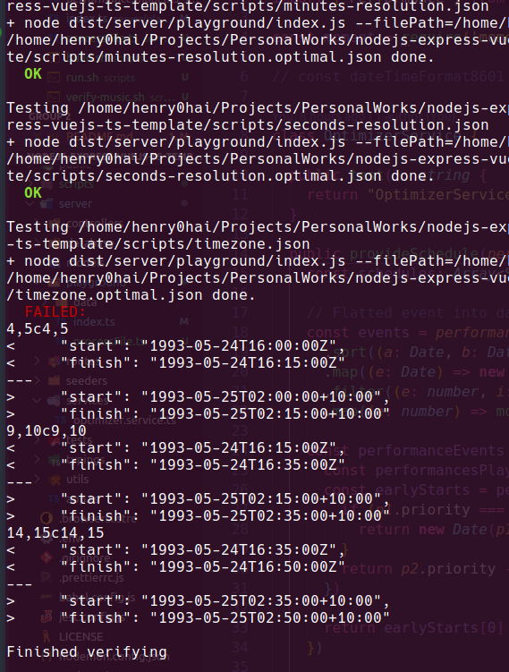

# Skedulo backend-tech-test

## Requirement

- Input:
  - List of performance => `performances`

- Output
  - List of optimizer performance => `schedules`

## Solutions

### Generic

- Using NodeJS & TypeScript to solve
- Model: content model to present for `performance` & `schedule`
- Services: content `OptimizerService` to `process` **input** and `provide` **output** data
- Controllers: using for calling services and provide endpoint. In case I using it's to make some unit test with `jest`
- I'm using `playground` to test from bash file
- Scripts: content **input** data, **expected** data, scripts to **build**, **run** & **verify** code.

### Service Details (OptimizerService)

- Each `performances` have `start` & `finish` time, then I want to create a flat array to contain them ex: [`start-1`, `finish-1`, `start-2`, `finish-2`] => `events`

- With this `events` sort by time *ASC* and make this array *unique* by **time**

- Loop through `events` find `performances` are *playing* on this timeline. Sort `performances` should be **play first** => `earlyStarts` than other by condition **highest priority**, if *same priority* compare to **start time** then choose the **first one** => `performanceEvents`

- By `performanceEvents` compare *previous* and *current* value
  - if `previous` *priority* **smaller** than `current` *priority* and *is playing* then set `previous` to **stop** and store this change in `schedule` set **finish time** of `previous` to `current` **start time** and return this `schedule`
  - if `previous` and `current` have **same priority** then *continue* playing `previous`, store this `previous` in `schedule`
  - if `previous` *priority* **lager** than `current` *priority* then prepare to play `current`, set `current` **start time** is the time `previous` *finish* and store this change in `schedule` and return this `schedule`
  > Note: time store in `schedule` convert to ISO8601 date format, other case instead return `schedule` return null

- Finally have an array of `schedule` then make sure this array is *unique* by *comparing* each **properties**

## Testing

- using `yarn test`


- using scripts

```sh
./scripts/verify.sh
```



## Issues

- With `timezone.json` input data, can process and give correct `schedule` but cannot return to the timezone of this file.
- I think this conflict with requirement `DateTime’s are represented as strings in ISO8601 format.` => input not in ISO8601 format.
- In real case, it should convert by user side or should clarify input timezone and output timezone.
